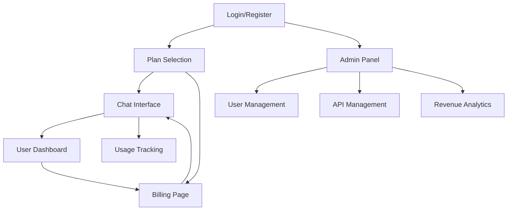

# AI Chatbot Platform - Product Requirements Document

## 1. Product Overview
A comprehensive AI chatbot platform that enables users to interact with multiple AI providers through a unified interface, with subscription-based monetization and a powerful admin panel for managing users, APIs, and billing.

The platform solves the complexity of managing multiple AI APIs while providing flexible pricing models (free, pay-per-message, monthly subscriptions) for different user needs. Target users include individual users, businesses, and developers seeking cost-effective AI chat solutions with transparent pricing.

## 2. Core Features

### 2.1 User Roles
| Role | Registration Method | Core Permissions |
|------|---------------------|------------------|
| Free User | Email registration | Limited messages per day, access to basic AI models |
| Premium User | Subscription upgrade | Unlimited messages, access to all AI models, priority support |
| Pay-per-Message User | Credit purchase | Pay only for messages used, access to premium AI models |
| Admin | Admin invitation/setup | Full system access, user management, API management, billing oversight |

### 2.2 Feature Module
Our AI chatbot platform consists of the following main pages:
1. **Chat Interface**: Main chat area, message history, AI model selection, usage tracking
2. **User Dashboard**: Profile management, subscription status, billing history, usage analytics
3. **Admin Panel**: User management, API configuration, subscription management, revenue analytics
4. **Billing Page**: Subscription plans, payment methods, invoice history
5. **API Management**: Admin interface for adding/configuring various AI APIs
6. **Login/Register**: User authentication, account creation, plan selection

### 2.3 Page Details
| Page Name | Module Name | Feature description |
|-----------|-------------|---------------------|
| Chat Interface | Chat Area | Send messages, receive AI responses, real-time conversation flow with usage tracking |
| Chat Interface | Model Selection | Switch between various AI models (GPT, Claude, Gemini, etc.) based on subscription |
| Chat Interface | Usage Indicator | Display remaining messages/credits, upgrade prompts for limits |
| User Dashboard | Profile Management | Update user information, change password, account settings |
| User Dashboard | Subscription Status | View current plan, usage statistics, billing cycle information |
| User Dashboard | Billing History | Access invoices, payment history, download receipts |
| User Dashboard | Usage Analytics | Detailed message count, cost breakdown, usage trends |
| Admin Panel | User Management | Create, edit, delete users, view user activity, manage subscriptions |
| Admin Panel | Revenue Analytics | View platform revenue, subscription metrics, user conversion rates |
| Admin Panel | System Settings | Platform configuration, usage limits, security settings |
| Billing Page | Subscription Plans | Display free, premium, pay-per-message plans with pricing |
| Billing Page | Payment Methods | Add/manage credit cards, PayPal, billing address |
| Billing Page | Invoice Management | Generate, view, download invoices and payment receipts |
| API Management | API Configuration | Add new AI providers, configure API keys, set rate limits |
| API Management | Model Management | Enable/disable specific AI models, set pricing per model |
| API Management | Usage Monitoring | Monitor API usage, costs, performance metrics per provider |
| Login/Register | Authentication | User login, registration, password reset, plan selection during signup |

## 3. Core Process
**Free User Flow:**
Register → Select free plan → Access chat interface → Use limited daily messages → Upgrade prompt when limit reached

**Premium User Flow:**
Register → Choose subscription plan → Complete payment → Access unlimited chat → Manage subscription in dashboard

**Pay-per-Message User Flow:**
Register → Purchase credits → Use chat interface → Credits deducted per message → Refill credits when needed

**Admin Flow:**
Admin login → Access admin panel → Add/configure AI APIs → Manage user subscriptions → Monitor revenue analytics → Set pricing and limits

## 4. User Interface Design
### 4.1 Design Style
- Primary colors: #2563eb (blue), #1e40af (dark blue)
- Secondary colors: #f8fafc (light gray), #64748b (medium gray)
- Button style: Rounded corners with subtle shadows
- Font: Inter, system fonts with 14px base size
- Layout style: Clean card-based design with sidebar navigation
- Icons: Lucide React icons for consistency

### 4.2 Page Design Overview
| Page Name | Module Name | UI Elements |
|-----------|-------------|-------------|
| Chat Interface | Chat Area | Full-height chat container, message bubbles with user/AI distinction, input field with send button |
| Chat Interface | Model Selection | Dropdown with AI model options, subscription badges, upgrade prompts |
| Chat Interface | Usage Indicator | Progress bar for message limits, credit counter, upgrade call-to-action |
| User Dashboard | Subscription Card | Plan status, usage metrics, billing cycle countdown, upgrade/downgrade buttons |
| User Dashboard | Analytics Charts | Usage graphs, cost breakdown charts, trend visualizations |
| Billing Page | Pricing Cards | Three-tier pricing layout, feature comparison, popular plan highlights |
| Billing Page | Payment Form | Secure payment fields, saved payment methods, billing address |
| API Management | Configuration Panel | API key input fields, toggle switches for models, rate limit sliders |
| Admin Panel | Revenue Dashboard | Revenue charts, subscription metrics, conversion funnels |
| Admin Panel | User Tables | Enhanced data tables with subscription status, usage data, billing actions |

### 4.3 Responsiveness
Mobile-first responsive design with breakpoints at 768px and 1024px, touch-optimized interface for mobile devices, collapsible sidebar navigation for smaller screens.