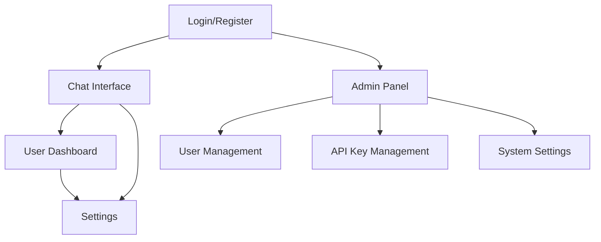

# AI Chatbot Platform - Product Requirements Document

## 1. Product Overview
A comprehensive AI chatbot platform that enables users to interact with multiple AI providers through a unified interface, with a powerful admin panel for managing users, API keys, and system configurations.

The platform solves the complexity of managing multiple AI APIs by providing a single interface for users while giving administrators complete control over access, usage, and API key management. Target users include businesses, developers, and organizations looking for a centralized AI chat solution.

## 2. Core Features

### 2.1 User Roles
| Role | Registration Method | Core Permissions |
|------|---------------------|------------------|
| Regular User | Email registration | Can access chat interface, view chat history |
| Admin | Admin invitation/setup | Full system access, user management, API key management |

### 2.2 Feature Module
Our AI chatbot platform consists of the following main pages:
1. **Chat Interface**: Main chat area, message history, AI provider selection
2. **User Dashboard**: Profile management, usage statistics, chat history
3. **Admin Panel**: User management, API key configuration, system settings
4. **Login/Register**: User authentication, account creation
5. **Settings**: User preferences, theme selection, notification settings

### 2.3 Page Details
| Page Name | Module Name | Feature description |
|-----------|-------------|---------------------|
| Chat Interface | Chat Area | Send messages, receive AI responses, real-time conversation flow |
| Chat Interface | Provider Selection | Switch between Google AI Studio and OpenRouter APIs |
| Chat Interface | Message History | Display conversation history, search previous messages |
| User Dashboard | Profile Management | Update user information, change password |
| User Dashboard | Usage Statistics | View API usage, message count, cost tracking |
| User Dashboard | Chat History | Access and manage previous conversations |
| Admin Panel | User Management | Create, edit, delete users, view user activity |
| Admin Panel | API Key Management | Configure Google AI Studio and OpenRouter API keys |
| Admin Panel | System Settings | Platform configuration, usage limits, security settings |
| Login/Register | Authentication | User login, registration, password reset |
| Settings | User Preferences | Theme selection, language settings, notification preferences |

## 3. Core Process
**Regular User Flow:**
Users register/login → Access chat interface → Select AI provider → Send messages → Receive AI responses → View chat history in dashboard

**Admin Flow:**
Admin login → Access admin panel → Manage users and API keys → Configure system settings → Monitor usage statistics

## 4. User Interface Design
### 4.1 Design Style
- Primary colors: #2563eb (blue), #1e40af (dark blue)
- Secondary colors: #f8fafc (light gray), #64748b (medium gray)
- Button style: Rounded corners with subtle shadows
- Font: Inter, system fonts with 14px base size
- Layout style: Clean card-based design with sidebar navigation
- Icons: Lucide React icons for consistency

### 4.2 Page Design Overview
| Page Name | Module Name | UI Elements |
|-----------|-------------|-------------|
| Chat Interface | Chat Area | Full-height chat container, message bubbles with user/AI distinction, input field with send button |
| Chat Interface | Provider Selection | Dropdown or toggle for AI provider selection, status indicators |
| User Dashboard | Profile Section | Card layout with form fields, avatar upload, save button |
| Admin Panel | Management Tables | Data tables with search, pagination, action buttons |
| Login/Register | Auth Forms | Centered forms with validation, social login options |

### 4.3 Responsiveness
Mobile-first responsive design with breakpoints at 768px and 1024px, touch-optimized interface for mobile devices, collapsible sidebar navigation for smaller screens.